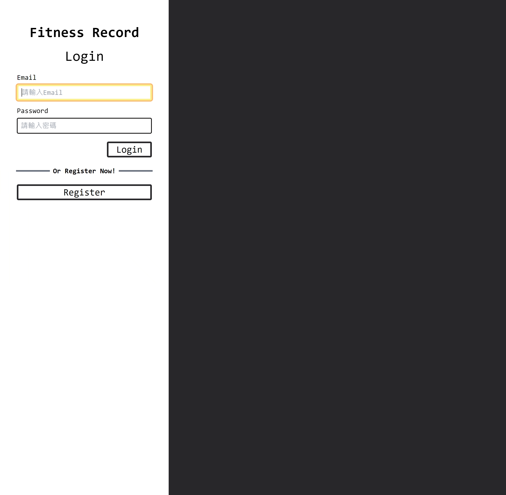

# Fitness Record
這是一個基於React.js和Tailwind打造的健身紀錄網頁應用程式前端畫面，並使用axios串接自製的API([我的後端repo連結](https://github.com/iamcoolalan/fitness-record-backend))。使用者可以使用此網站，查看、記錄、編輯、刪除自己的訓練與身體數據紀錄，並且透過查看數據，分析自己的訓練狀況與品質。

## Deploy on Github Page
[網頁連結](https://iamcoolalan.github.io/fitness-record-frontend/)

## 目錄

- [Feature - 產品功能](#feature---產品功能)
- [Demo - 功能展示](#demo-功能展示)
- [Installation- 安裝](#installation---安裝)
- [Package - 使用套件](#package---使用套件)
- [Creator - 創作者](#creator---創作者)

## Feature - 產品功能

- 登入系統
  - 使用者可以透過自己註冊的資訊登入
  - 使用者可以註冊
- 使用者相關功能
  - 使用者可以查看/修改 基本資料
  - 使用者可以查看/修改 目標
- 訓練紀錄相關功能
  - 使用者可以查看/新增/修改/刪除 訓練紀錄
  - 使用者可以查看特定訓練紀錄
  - 使用者可以查看/新增/修改/刪除 訓練紀錄細項
- 身體數據記錄相關功能
  - 使用者可以查看/新增/修改/刪除 身體數據紀錄
  - 使用者可以查看特定身體數據紀錄

## Demo 功能展示

### 登入系統


### 使用者功能

### 訓練紀錄

### 身體數據紀錄

## Installation - 安裝

1. 請先確認已安裝好 [fitness record後端專案](https://github.com/iamcoolalan/fitness-record-backend)
2. 將專案 clone 至本地
3. 在本地開啟後，透過終端機進入資料夾，輸入 :

    ```bash
    npm install
    ```

4. 在終端機中輸入以下指令啟動程式
    ##### * 請先啟動後端程式

     ```bash
    npm run start
    ```
5. 若在終端機中看見此行訊息則代表順利運行，打開瀏覽器進入下列網址

    ```bash
    App is running on http://localhost:3000
    ```

6. 若欲暫停使用

    ```bash
    ctrl + c
    ```

## Package - 使用套件

| Package | version |
| :--- | :--- |
| react | v18..2.0 |
| react-dom | v18.2.0 |
| react-router-dom | v6.16.0 |
| clsx | v2.0.0 |
| axios | v1.5.1 |
| gh-pages | v6.1.0|
| recharts | v2.9.3 |
| date-fns | v2.30.0 |
| jwt-decode | v4.0.0 |
| sweetalert2 | v11.7.32 |

## Creator - 創作者

### iamcoolAlan